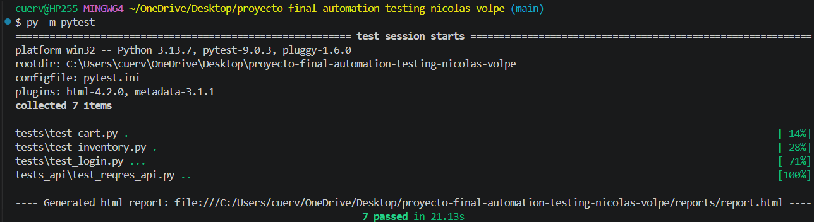
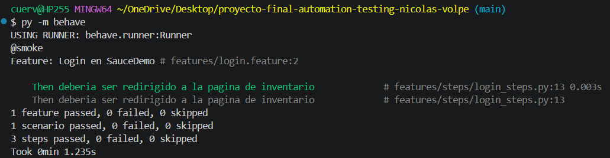

# Proyecto Final Automation Testing - Nicolás Volpe Bonola

## Descripción
Framework de automatización de pruebas para el sitio SauceDemo y APIs de JSONPlaceholder. Implementa patrones Page Object Model (POM), Data-Driven Testing (DDT) y BDD con Behave.

## Tecnologías
- Python 3.x
- Selenium WebDriver
- Pytest
- Behave
- Requests

## Instrucciones de Instalación
1. Clona el repositorio.
2. Instala las dependencias: `pip install -r requirements.txt`

## Ejecución de pruebas
- Ejecutar tests UI y API: `py -m pytest -v`
- Ejecutar tests BDD: `py -m behave`

## Resultados de Ejecución

Aquí puedes ver la evidencia de que las pruebas fueron ejecutadas con éxito:

### Ejecución de Pruebas UI y API

### Ejecución de Pruebas BDD
